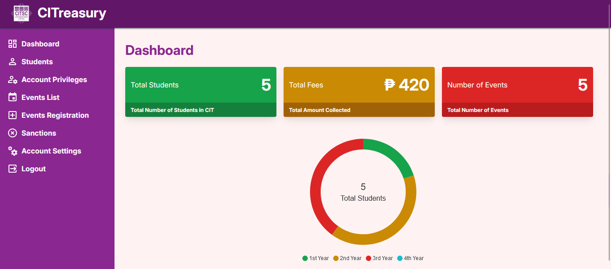
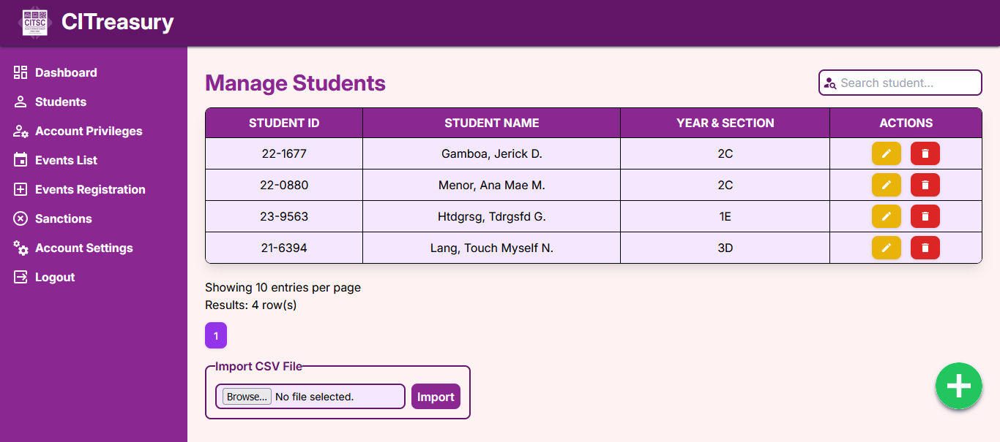

# CITreasury SQLite
A Student Fee Collection System that uses SQLite as database, written in PHP

## Notice
This is just the same as [CITreasury](https://github.com/jhzrmx/CITreasury) in my repository. Probably will be abandoned in the future.

## Screenshots:

## How to use?
1. Clone this repository to hosting directory (e.g.. htdocs folder in XAMPP)
2. Start the web server
3. The default admin account was:
   - Email: jhz.rmx@cbsua.edu.ph
   - Password: cit-22-1342
5. If `citreasury.db` file does not exists, then reset it by going to this URL: http://localhost/CITreasury-SQLite-main/reset.php
6. This will re-initialize the database and show relevant information about the admin account
